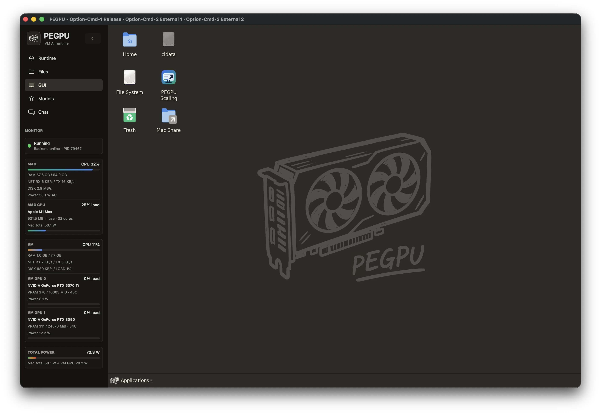
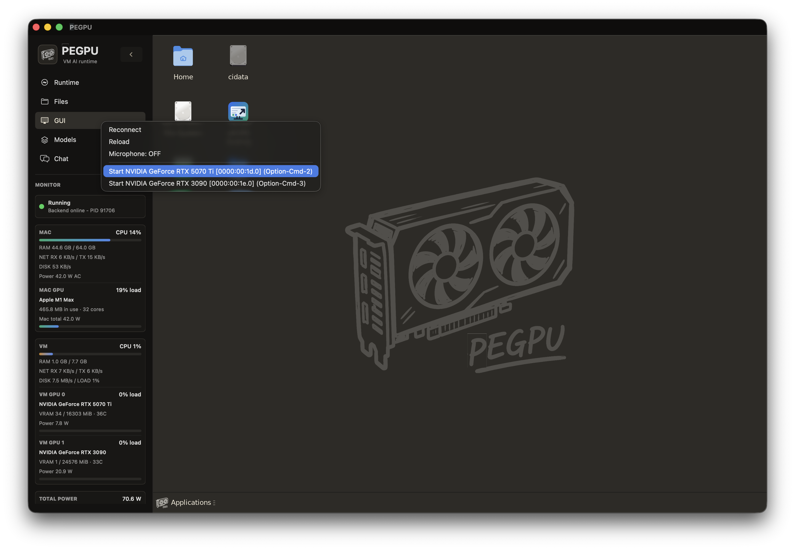
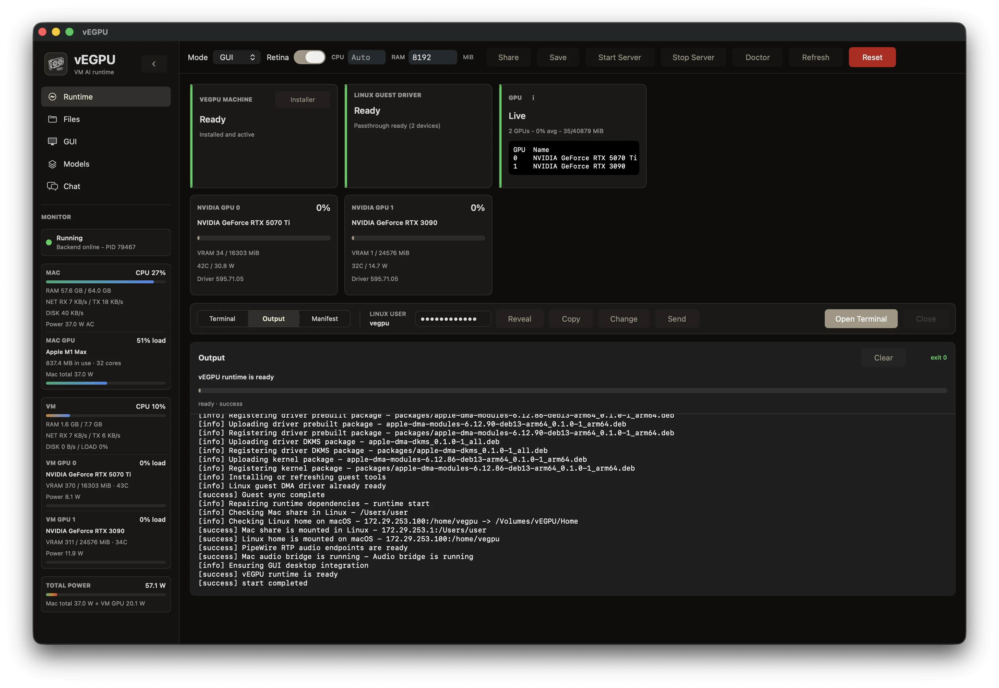
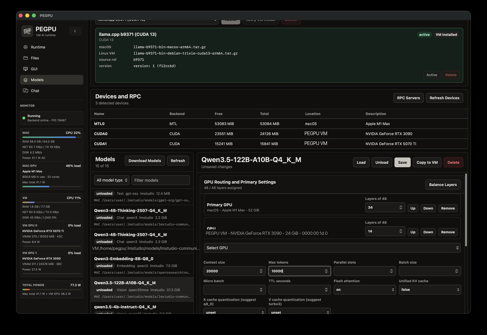
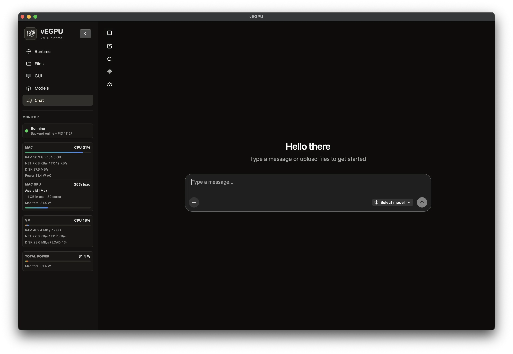
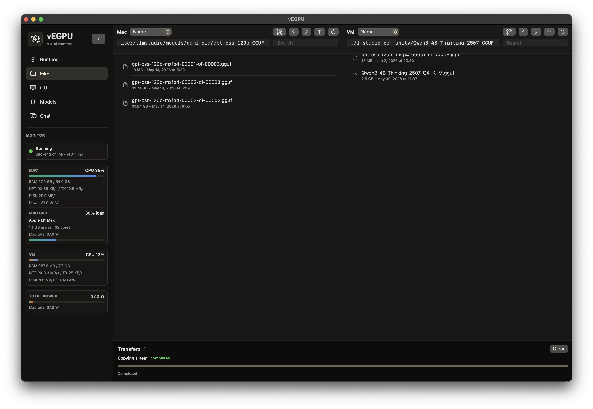

# PEGPU Gallery

[Back to README](README.md)

## GUI

The internal Linux desktop is rendered inside the macOS app through the UTM-derived SPICE, ANGLE, and CocoaSpice path, so setup and normal GUI work stay accelerated without using the passed-through NVIDIA card for the desktop.

## External Displays

Secondary-click in the GUI tab to turn on external display sessions on eGPUs. There is no fixed limit: each GPU has its own external display session, and every monitor connected to that GPU shares the same session so Linux/NVIDIA settings can extend or mirror them. Move into a session with the app-shown shortcuts for that GPU, from `⌥⌘2` through `⌥⌘9`; `⌥⌘1` always releases control back to the Mac. The main Mac-driven GUI does not lock the pointer because it uses absolute mouse mirroring directly on the screen.

## Runtime

The Runtime view starts and stops the PEGPU Machine server, shows whether the VM/control routes are alive, and keeps Mac, guest, network, disk, and VM GPU telemetry in one place. It also launches the recipe-based Debian setup and NVIDIA/CUDA helper install flow, because the download does not ship a bundled VM or preinstalled GPU driver stack.

## Models

The Models view manages model files and llama.cpp launches. Pick the Mac backend, the Linux/eGPU backend, or a split run where llama.cpp RPC bridges host and guest; TurboQuant is only the optional llama.cpp build/flag path for KV-cache quantization, not a separate GPU target. The UI assembles the real launch details: devices, RPC endpoint, GPU layers, tensor split, and cache type.

> **Tip:** Models does not repeatedly probe SSH for devices. With the VM running and GPU passthrough active, click Refresh Devices once to surface all connected GPUs.

## Chat

The Chat tab talks to the currently loaded model through the local OpenAI-compatible route. It is there to test the selected model, backend, and split inference path from inside PEGPU before you point another app at the same runtime.

## Files

The Files tab is a two-pane Mac and Linux file manager for the shared runtime paths. It handles browsing, drag/drop copy or move, transfer jobs, mount repair, and Finder handoff, so moving models, downloads, outputs, and VM files does not require falling back to ad hoc scp commands every time.
