# PEGPU Installation Manual

[Back to README](README.md)

## Contents

- [Step 00: Download Latest Version](#step-00-download-latest-version)
- [First Run](#first-run)
- [1. Disable SIP on Apple Silicon](#1-disable-sip-on-apple-silicon)
- [2. Unblock the Downloaded Package](#2-unblock-the-downloaded-package)
- [3. Install the Package](#3-install-the-package)
- [4. Approve the DriverKit Extension](#4-approve-the-driverkit-extension)
- [5. Start PEGPU With No eGPU Plugged In](#5-start-pegpu-with-no-egpu-plugged-in)
- [6. Install NVIDIA Support Inside the VM](#6-install-nvidia-support-inside-the-vm)
- [7. Stop the VM, Attach eGPUs, Then Launch the Server With Them Attached](#7-stop-the-vm-attach-egpus-then-launch-the-server-with-them-attached)
- [Note](#note)

---

## Step 00: Download Latest Version

Download the latest version from Releases before starting the setup flow.

<p align="center">
  <a href="https://github.com/openresearchtools/PEGPU/releases/latest">
    
  </a>
</p>

> [!WARNING]
> **Important upfront warning:** PEGPU requires installing an experimental
> kernel driver extension that has not yet been notarized by Apple. As a
> result, System Integrity Protection (SIP) must be disabled before PEGPU can
> be installed.
>
> To disable SIP:
>
> 1. Shut down your Mac.
> 2. Press and hold the power button until startup options appear.
> 3. Select **Options** to enter Recovery Mode.
> 4. Open **Terminal** from the menu bar.
> 5. Run the following command:
>
>    ```sh
>    csrutil disable
>    ```
>
> Restart your Mac normally.
>
> **Important:** Understand and consider the security risks of disabling SIP
> before proceeding.

---

## First Run

Installation is the strange part, so here is the path through macOS security.

PEGPU is experimental kernel-driver-adjacent software for Apple Silicon Macs
with SIP disabled, and the DriverKit extension is ad hoc signed. The warnings
below are expected for this kind of package, but they are still real security
decisions.

---

## 1. Disable SIP on Apple Silicon

Shut down, boot to startup options, open Recovery Terminal, run
`csrutil disable`, restart, and understand the security cost before continuing.
PEGPU depends on an experimental DriverKit/VFIO path for Thunderbolt PCIe
passthrough, so SIP must be disabled before macOS will allow the required
host-side extension flow.

---

## 2. Unblock the Downloaded Package

The package installs both PEGPU and PEGPU Machine. Because it comes from GitHub
and the DriverKit side is ad hoc signed, macOS may block the first launch. If
macOS says the package was not opened, go to System Settings, Privacy &
Security, and choose Open Anyway for the blocked PEGPU package. You can also
remove the quarantine flag from the download in Terminal:

```sh
xattr -dr com.apple.quarantine ~/Downloads/pegpu*.pkg
```

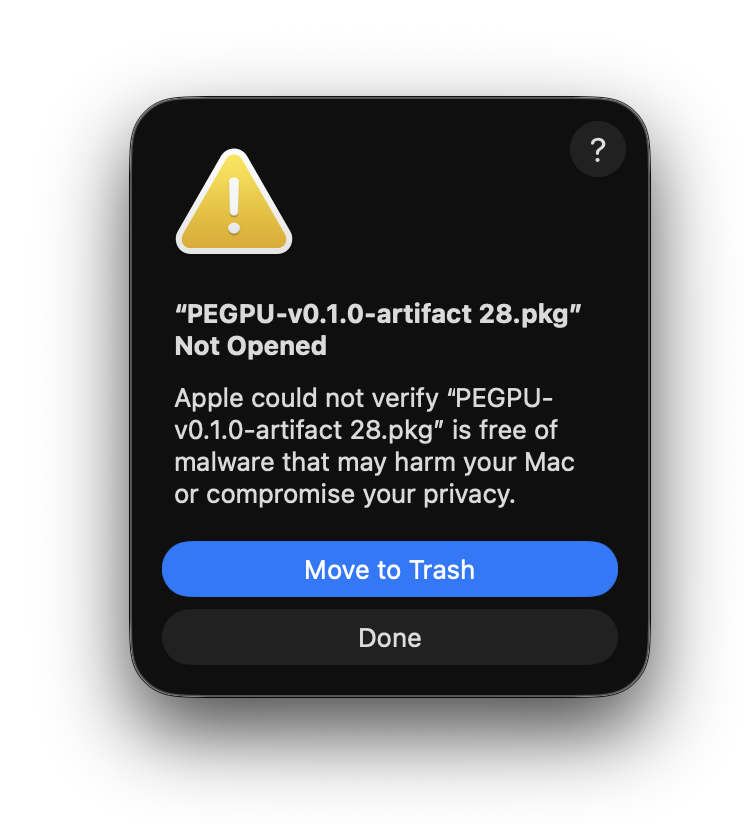

*Initial block*

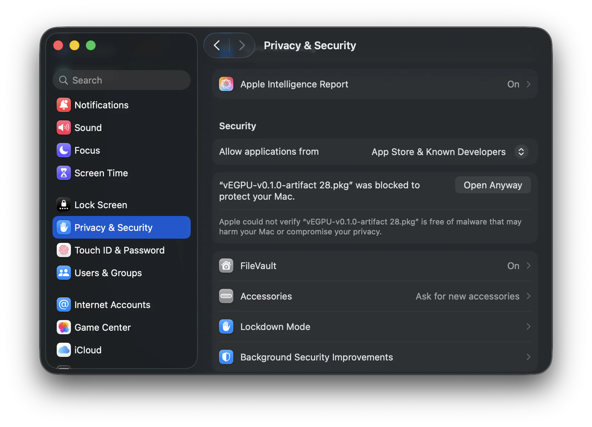

*Open Anyway*

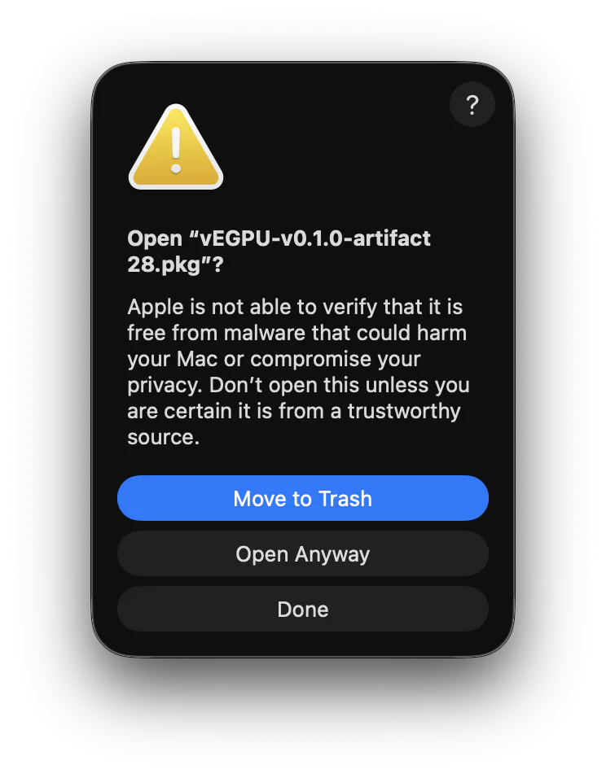

*Confirm open*

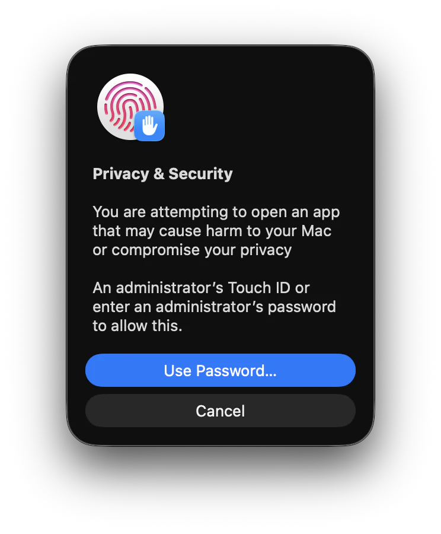

*Admin approval*

---

## 3. Install the Package

The installer password notice is the normal macOS authorization prompt for a
`.pkg`. It installs the app plus the Machine components that let QEMU and the
DriverKit extension talk to Thunderbolt PCIe hardware.

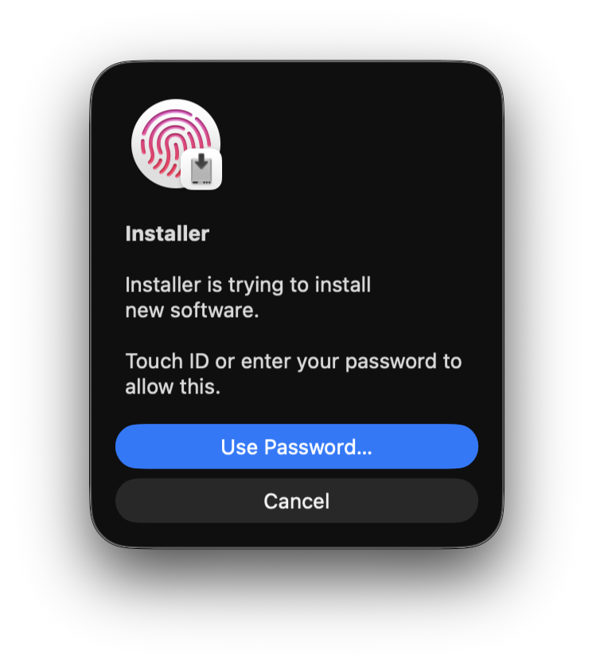

*Normal package authorization*

---

## 4. Approve the DriverKit Extension

When PEGPU Machine asks to use a new driver extension, click *Open System
Settings*, not OK. OK closes the alert without opening the approval page. In
Driver Extensions, enable `PEGPU Machine`, approve the System Extensions
prompt, and confirm the toggle is on.

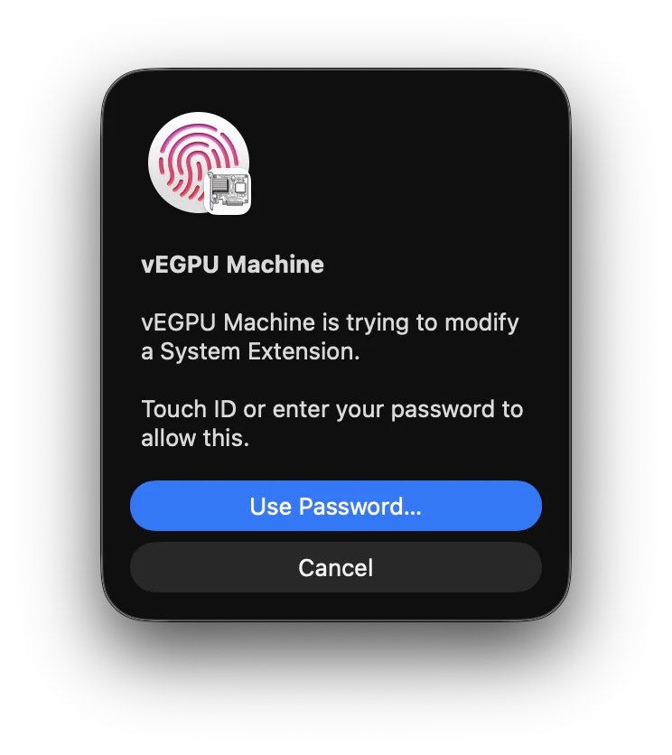

*Allow modification*

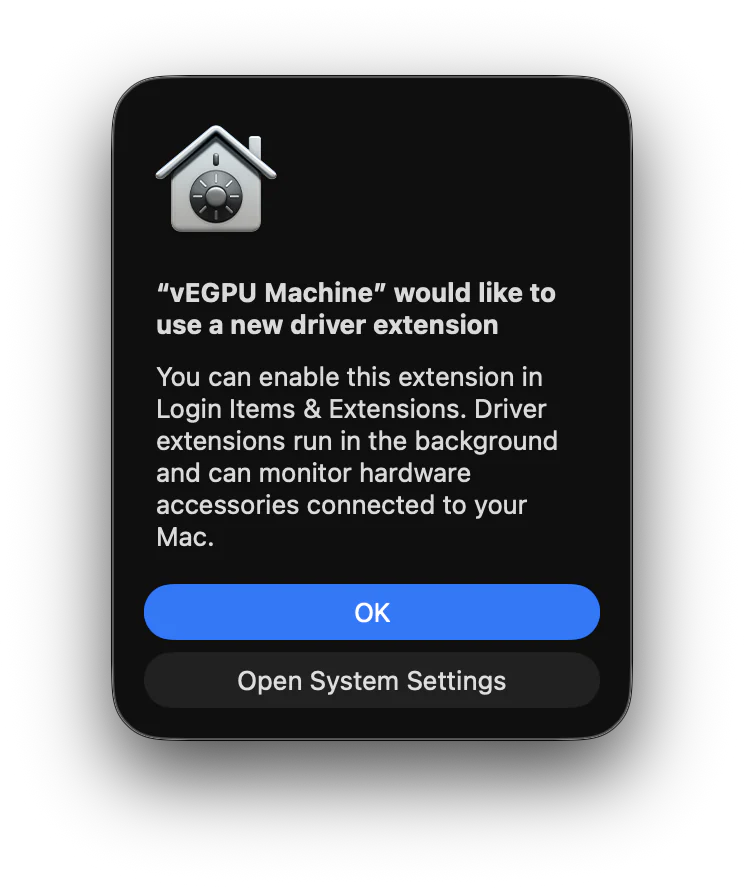

*Choose Open System Settings*

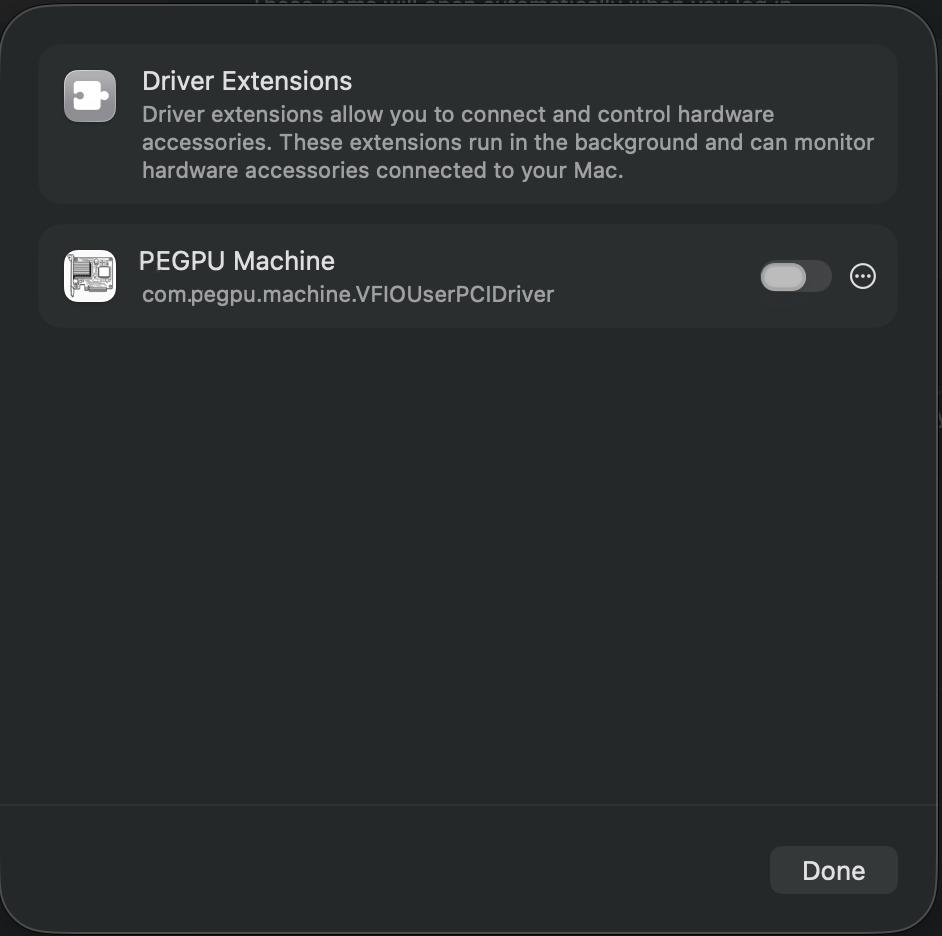

*Toggle on*

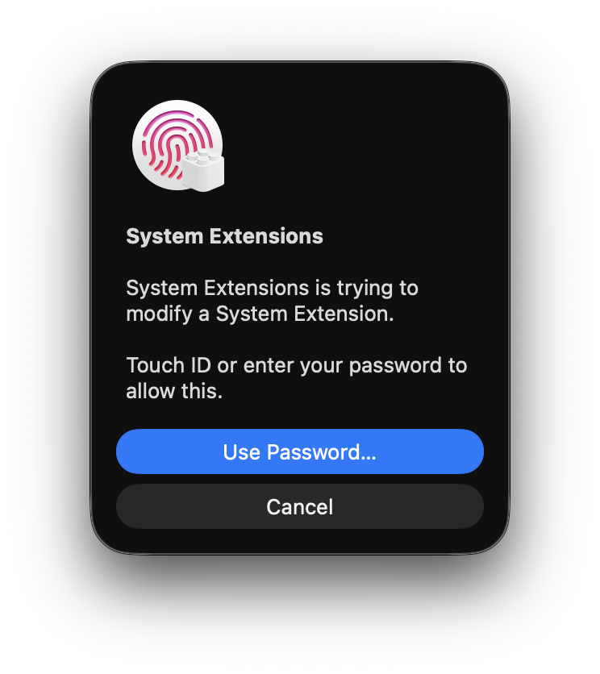

*Confirm system change*

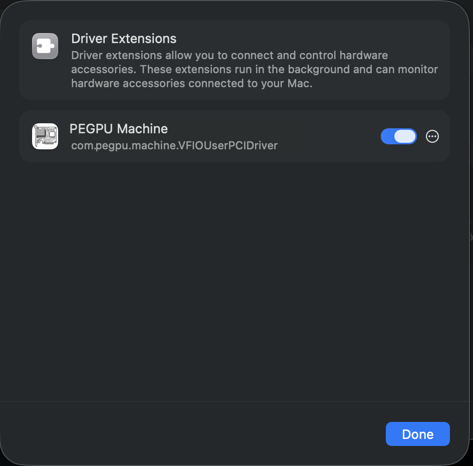

*Enabled*

---

## 5. Start PEGPU With No eGPU Plugged In

Let it fetch the official Debian cloud image, expand the disk, run cloud-init,
install base packages, and load the Linux DMA guest driver.

> [!WARNING]
> **Warning: do not plug in eGPUs for this step.**
>
> Booting the VM with external GPUs attached before the Linux guest driver and
> NVIDIA stack are installed is very likely to kernel panic macOS.

### Allow the First-Run Helpers

Local Network access is required for the private Mac-to-VM connection: SSH
control, web UI tabs, proxy routes, runtime RPC, file sharing, and guest setup
all depend on it. The Linux share password prompt mounts the VM home folder
over the private vmnet NFS link. The sleep guard helper prevents macOS sleep
while PCIe passthrough is active, because sleep can wedge or panic the machine.

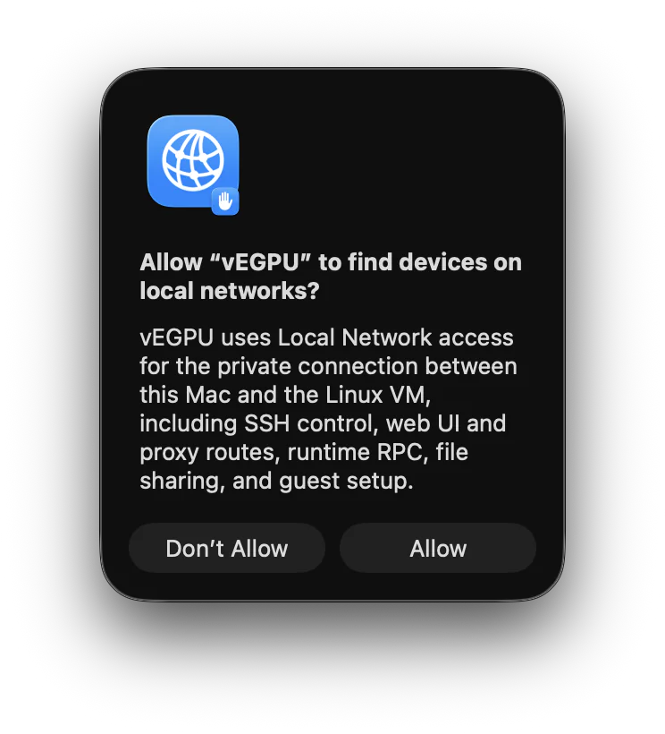

*Allow Local Network*

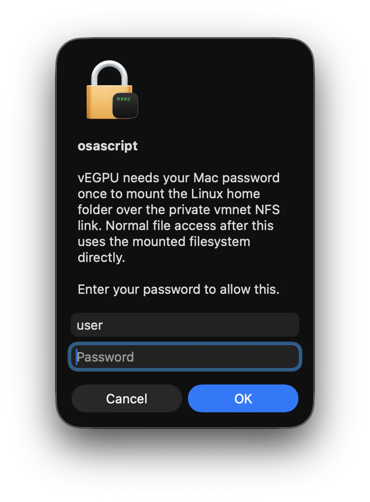

*Mount Linux share*

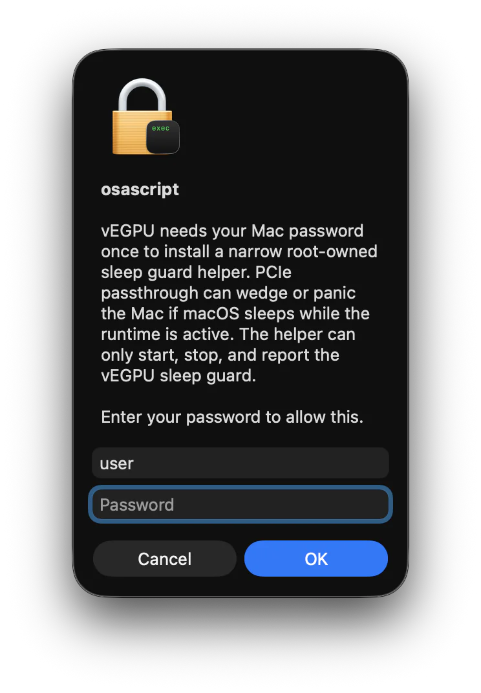

*Install sleep guard*

---

## 6. Install NVIDIA Support Inside the VM

The helper configures NVIDIA's Debian repository and installs driver/CUDA
packages via apt. PEGPU does not ship those packages. If you use NVIDIA cards,
run the helper inside PEGPU after the first Debian boot finishes. You can also
ignore the helper and install drivers yourself through the GUI, SSH, or the
embedded terminal.

> [!WARNING]
> **Warning: do not launch with eGPUs attached before this is done.**
>
> Starting the VM with NVIDIA cards passed through before the driver stack is
> installed is very likely to kernel panic macOS.

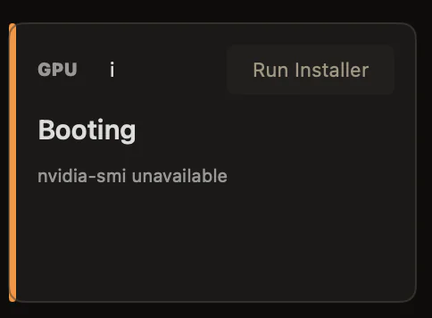

*Run Installer*

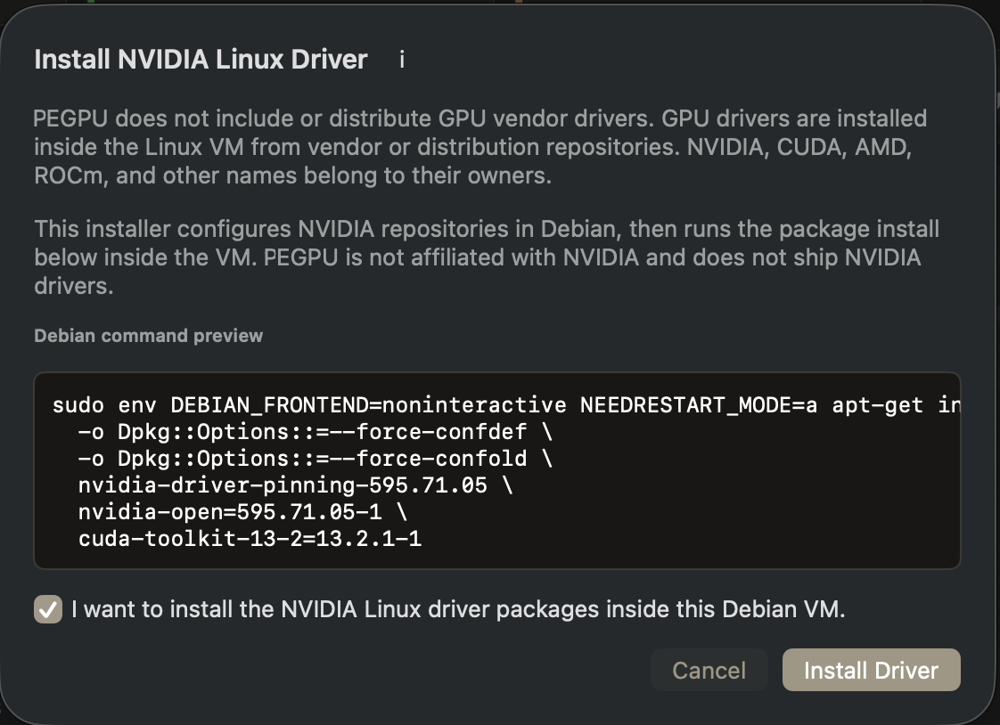

*Install Driver confirmation*

---

## 7. Stop the VM, Attach eGPUs, Then Launch the Server With Them Attached

If Sidecar does not show the cards, stop the server, unplug the eGPUs, wait 5
seconds, plug them back in, wait another 5 seconds, and launch again. This does
not reinstall the VM; it gives macOS another clean chance to hand the PCIe
devices to QEMU.

---

## Note

PEGPU does not ship a pre-made VM, and it does not pre-install GPU vendor
drivers, because licensing and distribution of VM images, NVIDIA drivers, and
CUDA packages gets complicated fast. First startup can take half an hour
depending on the Mac and network because it fetches a clean Debian cloud image
from the official Debian repository, then uses scripts to install packages and
drivers from their official repositories. NVIDIA/CUDA installation can add
another 20-ish minutes, and only runs if you explicitly click the NVIDIA driver
install helper and accept the script and terms. You can also ignore the helper
and install drivers yourself through the GUI, SSH, or the embedded terminal.
Headless mode skips the XFCE dependency tree if all you want is compute, SSH,
and terminal work.
